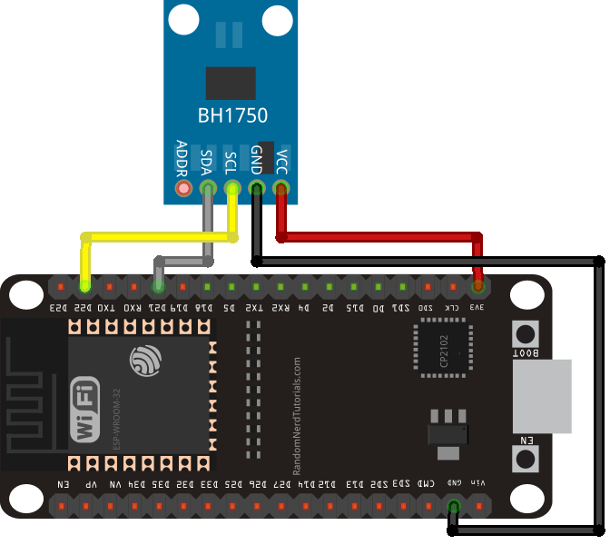

# Sensor Solar

Para o projeto utilizaremos o **BH1750 – Ambient Light Sensor**.

[Sensor de intensidade luminosa GY-30 (BH1750FVI)](https://randomnerdtutorials.com/esp32-bh1750-ambient-light-sensor/)

## Introduzindo o *BH1750 Ambient Light Sensor*

O *BH1750* é um sensor de luz ambiente de 16 *bits* que se comunica através do [**protocolo I2C**](https://github.com/FNakano/CFA/tree/master/projetos/I2C). Produz medições de luminosidade em *lux* (unidade derivada de SI de iluminação). Pode medir um mínimo de 1 *lux* e um máximo de 65535 *lux*.

## Características do *BH1750*

Aqui está uma lista dos recursos do sensor BH1750. Para mais informações consulte o [**BH1750 sensor datasheet**](https://datasheet.octopart.com/BH1750FVI-TR-Rohm-datasheet-25365051.pdf).
- Interface I2C 
- Faixa: 1 – 65535 lux 
- Baixa corrente por função de desligamento de energia 
- Função de rejeição de ruído leve de 50Hz / 60Hz 
- Pequena variação de medição (+/- 20%) 
- Pouca influência do infravermelho 
- Suporta modo de medição contínua 
- Suporta o modo de medição único

## Modos de Medição

O sensor suporta dois modos de medição diferentes: *continuous measurement mode* e *one-time measurement mode*. Cada modo suporta três modos de resolução diferentes.

| Resolução | Precisão | Tempo de Medição |
| :---: | :---: | :---: |
| Modo de Baixa Resolução | 4 lux | 16 ms |
| Modo de Alta Resolução | 1 lux | 120 ms |
| Modo de Alta Resolução 2 | 0.5 lux | 120 ms |

No *continuous measurement mode*, o sensor mede continuamente os valores da luz ambiente. No *one-time measurement mode*, o sensor mede o valor da luz ambiente uma vez, e então ele vai para o modo de desligamento.

## BH1750 Pinout

| Pinout | Descrição |
| :---: | :---: |
| VCC | Alimenta o sensor (3.3V ou 5V) |
| GND | GND comum |
| SCL | Pino SCL para comunicação I2C |
| SDA (Data) | Pino SDA para comunicação I2C |
| ADD* | Seleciona endereço |

O pino ADD é usado para definir o endereço do sensor I2C. Se a tensão nesse pino for inferior a 0,7VCC (o pino é deixado ignorado ou conectado ao GND), o endereço I2C será ```0x23```. Mas, se a tensão for superior a 0,7xVCC (o pino está conectado ao VCC), o endereço é ```0x5C```. Resumindo:
- Ignorar o pino ou conectar ao ```GND``` → endereço: ```0x23``` 
- Adicionar pino conectado ao ```VCC``` → endereço: ```0x5C```

## BH1750 Interface I2C

O sensor de luz ambiente BH1750 suporta interface I2C. Eu conectei o sensor BH1750 ao ESP32 usando os pinos I2C padrão:

| BH1750 | ESP32 |
| :---: | :---: |
| SCL | ```GPIO 22``` |
| SDA | ```GPIO 21``` |

## Esquema – ESP32 com BH1750



| BH1750 | ESP32 |
| :---: | :---: |
| VCC | ```3.3V``` |
| GND | ```GND``` |
| SCL | ```GPIO 22``` |
| SDA | ```GPIO 21``` |
| ADD* | Não conecta |

Ao não conectar o pino ADD, estamos selecionando o endereço I2C ```0x23```. Conecte-o a 3.3V para selecionar o endereço ```0x5C```.

[GYML8511 UV Sensor](http://wiki.sunfounder.cc/index.php?title=GYML8511_UV_Sensor)
