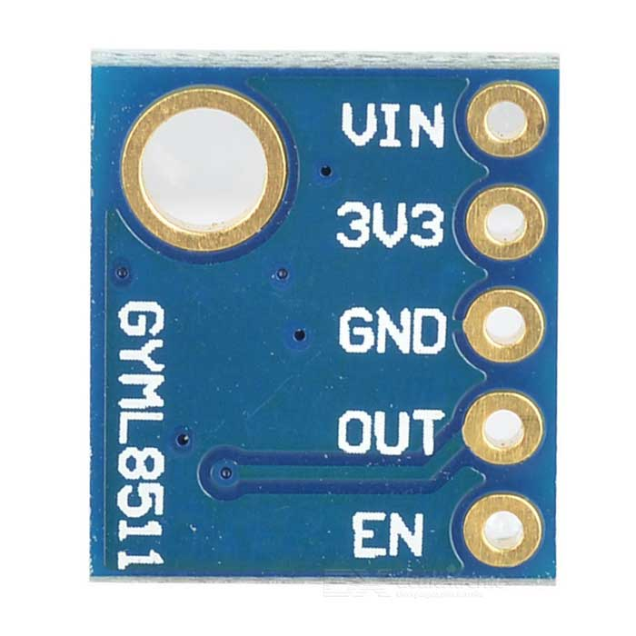
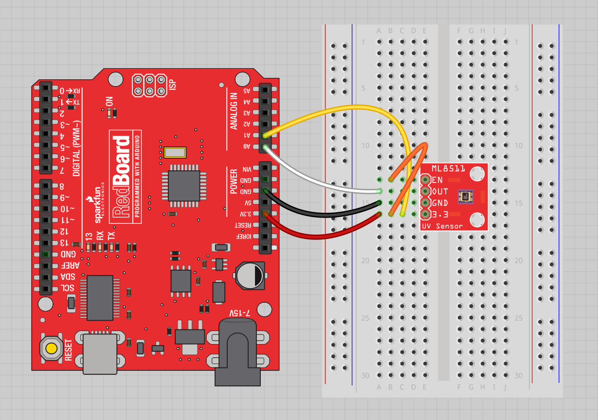
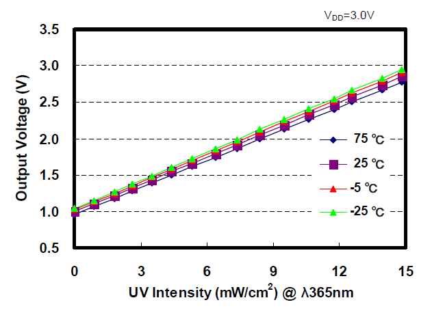

# Sensor Solar

Para o projeto será utilizado o **BH1750 – Ambient Light Sensor** e o **ML8511 UV Sensor**.

## Introduzindo o *BH1750 Ambient Light Sensor*


O *BH1750* é um sensor de luz ambiente de 16 *bits* que se comunica através do [**protocolo I2C**](https://github.com/FNakano/CFA/tree/master/projetos/I2C). Produz medições de luminosidade em *lux* (unidade derivada de SI de iluminação). Pode medir um mínimo de 1 *lux* e um máximo de 65535 *lux*.

### Características do *BH1750*

Aqui está uma lista dos recursos do sensor BH1750. Para mais informações consultar o [**BH1750 sensor datasheet**](https://datasheet.octopart.com/BH1750FVI-TR-Rohm-datasheet-25365051.pdf).
- Interface I2C 
- Faixa: 1 – 65535 lux 
- Baixa corrente por função de desligamento de energia 
- Função de rejeição de ruído leve de 50Hz / 60Hz 
- Pequena variação de medição (+/- 20%) 
- Pouca influência do infravermelho 
- Suporta modo de medição contínua 
- Suporta o modo de medição único

### Modos de Medição

O sensor suporta dois modos de medição diferentes: *continuous measurement mode* e *one-time measurement mode*. Cada modo suporta três modos de resolução diferentes.

| Resolução | Precisão | Tempo de Medição |
| :---: | :---: | :---: |
| Modo de Baixa Resolução | 4 lux | 16 ms |
| Modo de Alta Resolução | 1 lux | 120 ms |
| Modo de Alta Resolução 2 | 0.5 lux | 120 ms |

No *continuous measurement mode*, o sensor mede continuamente os valores da luz ambiente. No *one-time measurement mode*, o sensor mede o valor da luz ambiente uma vez, e então ele vai para o modo de desligamento.

### BH1750 Pinout

| Pinout | Descrição |
| :---: | :---: |
| VCC | Alimenta o sensor (3.3V ou 5V) |
| GND | GND comum |
| SCL | Pino SCL para comunicação I2C |
| SDA (Data) | Pino SDA para comunicação I2C |
| ADD* | Seleciona endereço |

O pino ADD é usado para definir o endereço do sensor I2C. Se a tensão nesse pino for inferior a 0,7VCC (o pino é deixado ignorado ou conectado ao GND), o endereço I2C será `0x23`. Mas, se a tensão for superior a 0,7xVCC (o pino está conectado ao VCC), o endereço é `0x5C`. Resumindo:
- Ignorar o pino ou conectar ao `GND` → endereço: `0x23` 
- Adicionar pino conectado ao `VCC` → endereço: `0x5C`

### BH1750 Interface I2C

O sensor de luz ambiente BH1750 suporta interface I2C. Conectar o sensor BH1750 ao ESP32 usando os pinos I2C padrão:

| BH1750 | ESP32 |
| :---: | :---: |
| SCL | `GPIO 22` |
| SDA | `GPIO 21` |

### Esquema – ESP32 com BH1750


| BH1750 | ESP32 |
| :---: | :---: |
| VCC | `3.3V` |
| GND | `GND` |
| SCL | `GPIO 22` |
| SDA | `GPIO 21` |
| ADD* | Não conecta |

Ao não conectar o pino ADD, será selecionado o endereço I2C `0x23`. Conectar a 3.3V para selecionar o endereço `0x5C`.

## Introduzindo o *ML8511 UV Sensor*



O ML8511 é um sensor de luz ultravioleta fácil de usar. O sensor UV MP8511 emite um sinal analógico em relação à quantidade de luz UV que detecta. Isso pode ser útil na criação de dispositivos que avisam o usuário de queimaduras solares ou detectam o índice UV no que se refere às condições climáticas. 

Este sensor detecta a luz de 280-390nm de forma mais eficaz. Isso é categorizado como parte do espectro UVB (raios de queima) e a maior parte do espectro UVA (raios bronzeadores).

### Características do *ML8511*

- Fotodiodo sensível a UV-A e UV-B 
- Amplificador operacional incorporado 
- Saída de tensão analógica 
- Baixa corrente de alimentação (300A typ.) e baixa corrente de espera (0,1A typ.) 
- Pacote de montagem em superfície pequeno e fino (4,0 mm x 3,7 mm x 0,73 mm, QFN cerâmico de 12 pinos)

### ML8511 Pinout

| ML8511 | Descrição |
| :---: | :---: |
| VIN | Entrada da tensão antes de ser regulado |
| 3V3 | Ânodo da fonte de alimentação 3.3V |
| GND | O cátodo da fonte de alimentação |
| OUT | Saída (Baixo consumo de energia desligado ou modo de espera) |
| EN | Pin de alta habilitação (Alto: Modo ativo, Baixo: Modo de espera) |

### Esquema – ESP32 com ML8511



| ML8511 | ESP32 |
| :---: | :---: |
| VIN | Não conecta |
| 3V3 | 3.3V |
| GND | GND |
| OUT | `GPIO 34` |
| EN | 3.3V |
| --- | 3.3V = `GPIO 35` |

Essas duas últimas conexões do ML8511 são um pouco diferentes. Conectar o `pino EN` no breakout a `3.3V` para ativar o dispositivo. Conectar também o `pino 3,3V` do ESP32 ao pino analógico `GPIO 35` do ESP32.

Para fins do projeto, as duas últimas conexões foram retiradas.

### Aumentar a precisão do ML8511

Com isso, é necessário um ADC do ESP32 mais preciso na tensão UV, para isso:
```C
UV_Voltage / uvLevel = 3.3 / refLevel
```
`uvLevel` é o que é lido do pino `OUT`. `refLevel` é o que é lido no pino de 3,3V. Resolvendo para `UV_Voltage`, é possível obter uma leitura precisa.

Para fins do projeto, `refLevel` foi transformado em uma constante de valor 4095.


