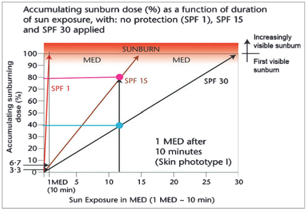
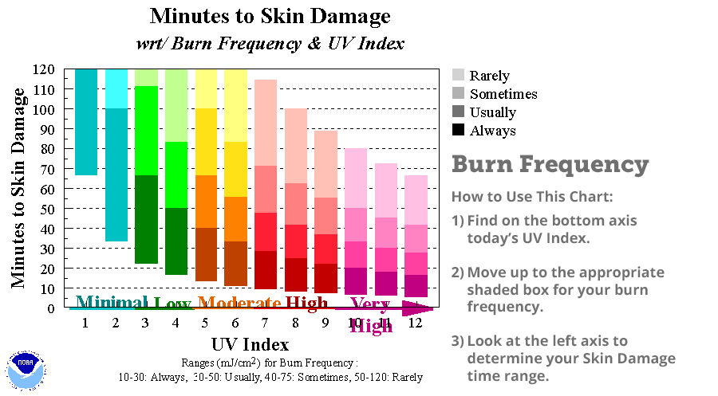

Bem vindo à documentação PROTETOR SOLAR ☀️
=============================================

O que é isso?
-------------

Esse é o projeto final da **Disciplina: ACH2157 - Computação Física e Aplicações**: https://github.com/FNakano/CFA

Nele está sendo proposto o uso do aplicativo **PROTETOR SOLAR**, como uma forma mais acessível do *UV Camera for Sunscreen Test*. O objetivo é que o usuário seja alertado pelo aplicativo, para repassar seu protetor solar conforme seu contexto.

Inspiração
^^^^^^^^^^

Ao olhar para o Objetivo de Desenvolvimento Sustentável 3. **Assegurar uma vida saudável e promover o bem-estar para todas e todos, em todas as idades**, foi pensado uma forma de promover o alinhamento específico do **3.4** - Até 2030, reduzir em um terço a mortalidade prematura por doenças não transmissíveis via prevenção e tratamento, e promover a saúde mental e o bem-estar.

Para isso, foi decidido incentivar à adoção de um novo hábito saudável e ajudar o usuário à manter-lo. Por exemplo, todos já passaram pela situação de começar o ano, com objetivos e planos bem estruturados, mas com o passar dos meses desistir deles. Esse *clássico* tipo de atitude será superado pelo usuário.

Então, ao começar por uma rotina simples de cuidados com a pele, está sendo oferecido ao usuário, a possibilidade dele, de criar seu hábito de passar o protetor o solar em momentos importantes, para isso o aplicativo tem a função de auxiliar e facilitar esse aprendizado.

Referência para o conceito de hábito: https://sites.google.com/view/sources-change/

Como funciona?
^^^^^^^^^^^^^^

Esta seção foi dividindo em duas partes, a primeira será dos objetos físicos que serão responsáveis por avaliar o contexto do usuário, e a segunda que são os programas para interpretar esse contexto e devolver uma decisão.

.. figure:: ../../img/esquema.png

Componentes
--------------

.. toctree::
    :maxdepth: 1

    comp/esp
    comp/sensor
    comp/bateria

*Softwares*
--------------

.. toctree::
    :maxdepth: 1

    software/aplicativo
    software/iot
    software/py
    software/ino
    software/ide

Pesquisa
--------

Uma recomendação comum de muitas agências de saúde pública é reaplicar o protetor solar a cada 2 a 3 horas, mas esta recomendação pode não ser a mais eficaz para minimizar a exposição ultravioleta da pele durante o tempo ao sol. Para os usuários de protetor solar, seria ideal aplicar protetor solar em locais expostos do corpo, 15 a 30 minutos antes de sair para o sol. E mais reaplicações são necessárias após atividades vigorosas que poderiam remover o protetor solar.

Sobre a reaplicação do protetor solar, existem quatro importantes variáveis:
    - Fator de Proteção Solar (FPS);
    - Tempo desde a última aplicação;
    - Índice Ultravioleta;
    - Remoção do protetor solar;

As duas primeiras variáveis estão bem relacionadas, como mostrado na figura, o comportamento dinâmico do FPS 1 (não protetor solar), FPS 15 e FPS 30 são mostrados. Após 12 MED (2 h no sol australiano), 80% da dose de queimaduras solares é atingida no pele de um indivíduo, mas apenas 40% quando um FPS 30 protetor solar é aplicado.

Além disso, o índice ultravioleta também precisa ser considerado, mas como o tempo para as pessoas sofrerem queimaduras na pele pode variar, será utilizado o gráfico apresentado pelo NOAA. O tempo limite para a reaplicação será de 120 minutos.

Por fim, existe a possibilidade de remoção não intencional por parte do usuário, como por exemplo a prática de exercício físico ou a presença de água, nesse caso, o tempo será reduzido pela metade, com um limite de 80 minutos.

No programa, as variaveis serao computadas da seguinte forma:

$$ t_f = \dfrac{t_i * f}{u} $$

Referências
-----------

https://docs.espressif.com/projects/esp-idf/en/latest/esp32/get-started/
https://docs.micropython.org/en/latest/esp32/quickref.html
https://datasheet.octopart.com/BH1750FVI-TR-Rohm-datasheet-25365051.pdf
http://wiki.sunfounder.cc/index.php?title=GYML8511_UV_Sensor
https://www.researchgate.net/requests/attachment/107953839
https://www.skincabin.com/guides/how-often-to-reapply-sunscreen/
https://pubmed.ncbi.nlm.nih.gov/11712033/
