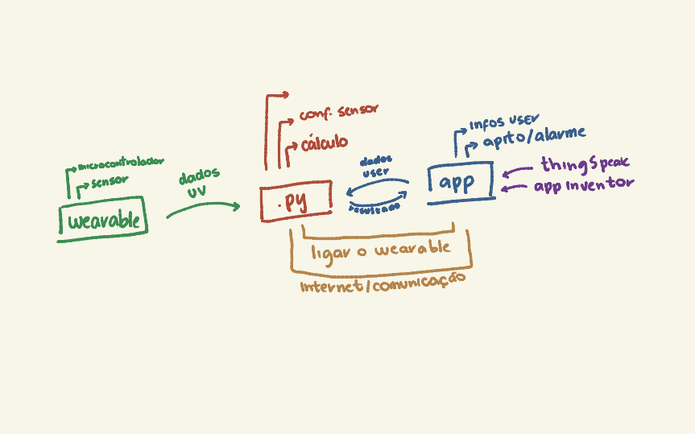

Bem vindo à documentação PROTETOR SOLAR ☀️☀️
=============================================

O que é isso?
-------------

Esse é o projeto final da **Disciplina: ACH2157 - Computação Física e Aplicações**: https://github.com/FNakano/CFA

Nele estamos propondo o uso do aplicativo **PROTETOR SOLAR ☀️☀️**, como uma forma mais acessível do *UV Camera for Sunscreen Test*. O objetivo é que o usuário seja alertado pelo aplicativo, para repassar seu protetor solar conforme seu contexto.

Inspiração
----------

Olhando para o Objetivo de Desenvolvimento Sustentável 3. **Assegurar uma vida saudável e promover o bem-estar para todas e todos, em todas as idades**, pensamos uma forma de promover o alinhamento específico do **3.4** - Até 2030, reduzir em um terço a mortalidade prematura por doenças não transmissíveis via prevenção e tratamento, e promover a saúde mental e o bem-estar.

Para isso, chegamos na conclusão de incentivar a adoção de um novo hábito saudável. Todos nós já passamos pela situação de começar o ano, com objetivos e planos bem estruturados, mas com o passar dos meses desistirmos deles. Esse *clássico* tipo de atitude que estamos planejando em ajudar o usuário à superar.

Então, começando por uma rotina simples de cuidados com a pele estamos oferecendo ao usuário, a possibilidade dele de criar seu hábito de passar o protetor o solar em momentos importantes, para isso o aplicativo tem a função de auxiliar e facilitar esse aprendizado.

Referência para o conceito de hábito: https://sites.google.com/view/sources-change/

Como funciona?
--------------

Para esta seção estamos dividindo-a em duas partes, a primeira será dos objetos físicos que serão responsáveis por avaliar o contexto do usuário, e a segunda que são os programas para interpretar esse contexto e devolver uma decisão.

    Figura 1: visualização do esquema

Os Componentes
^^^^^^^^^^^^^^

Para os componentes decidimos usar:

- *ESP32* 
- Sensor Solar 
- Bateria

Os *Softwares*
^^^^^^^^^^^^^^

Os *softwares* que serão utilizados:

- Aplicativo: http://appinventor.mit.edu/
- *IoT analytics*: https://thingspeak.com/

.. toctree::
   :maxdepth: 2

    py