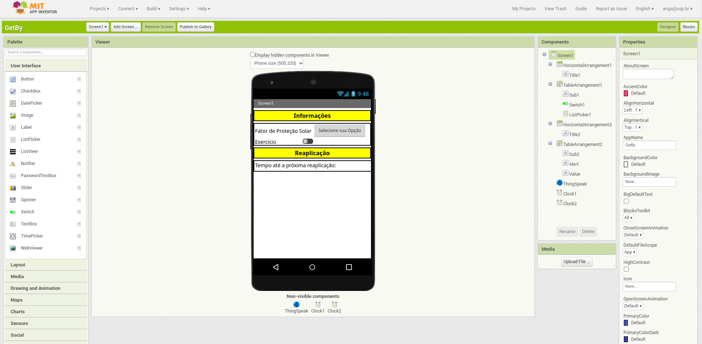
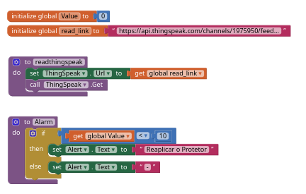
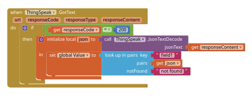
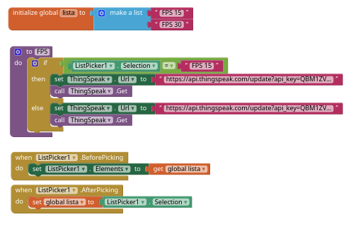
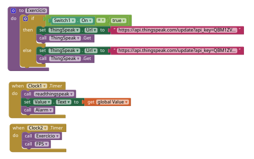

# Aplicativo

Será utilizado o **MIT App Inventor** para fazer o aplicativo.

## Introduzindo o *MIT App Inventor*

O [MIT App Inventor](http://appinventor.mit.edu/) é um ambiente de programação visual intuitivo que permite que todos criem aplicativos totalmente funcionais para telefones Android, iPhones e tablets Android / iOS. Além disso, a ferramenta baseada em blocos facilita a criação de aplicativos complexos e de alto impacto em significativamente menos tempo do que os ambientes de programação tradicionais. O projeto MIT App Inventor busca democratizar o desenvolvimento de software, capacitando todas as pessoas, especialmente os jovens, a passar do consumo de tecnologia para a criação de tecnologia.

Para a construção do aplicativo, ele será dividido em duas partes, a seção do [Designer](https://t16k-ach2157.readthedocs.io/en/latest/software/aplicativo.html#designer) e a do [Blocks](https://t16k-ach2157.readthedocs.io/en/latest/software/aplicativo.html#blocks).

### Designer

Nesta parte, o MIT App Inventor possibilita a criação da interface da aplicação.

Para o projeto foram utilizadas duas variáveis de saída (*Switch1* e *ListPicker1*) e uma variável de entrada (*Value*). Além disso foi colocado uma variável para alertar o usuário para reaplicar o protetor solar (*Alert*), duas variáveis para cronometro (*Clock1* e *Clock2*) e por fim, uma variável para a conexão com a internet (*ThingSpeak*).

### Blocks

Nesta parte, o MIT App Inventor capacita as aplicações desenvolvidas.

Então primeiro, foram declaradas duas variáveis (*Value* e *read_link*), a primeira é a mesma utilizada na seção **Designer**, ela recebe o valor do site *ThingSpeak* e o mostra na interface do usuário. A segunda, será o link que possibilita a leitura desse valor pelo ThingSpeak, utilizando o [API Requests](https://t16k-ach2157.readthedocs.io/en/latest/software/iot.html#api-keys). 

Além disso, foram criadas duas funções (*readthingspeak* e *Alarm*), a primeira para instruir como o *read_link* será utilizado, e a segunda para escrever na variável *Alarm* a notificação para reaplicar o protetor solar.

Com isso, a próxima imagem descreve como escrever o valor lido no ThingSpeak na variável *Value*. Note que é necessário declarar o *look up in pair key* usando o `field`.

Depois de mostrado a forma de leitura do aplicativo, será demonstrado a forma de enviar dados para o site. Primeiro será utilizada a variável *lista* que será responsável por habilitar o *ListPicker1*, este que está dentro da função *FPS* capaz de enviar os dados para o ThingSpeak.

A última função será o *Exercício* que fará uso da variável *Switch1* para enviar as informações para o site. Por fim, o *Clock1* e o *Clock2* serão responsáveis por dizer a frequência que cada função será executada.

