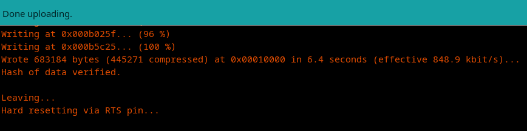
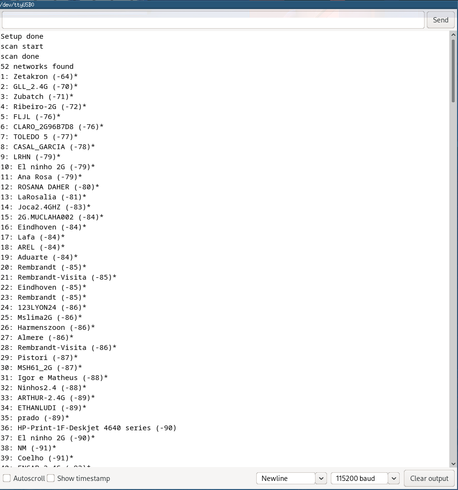
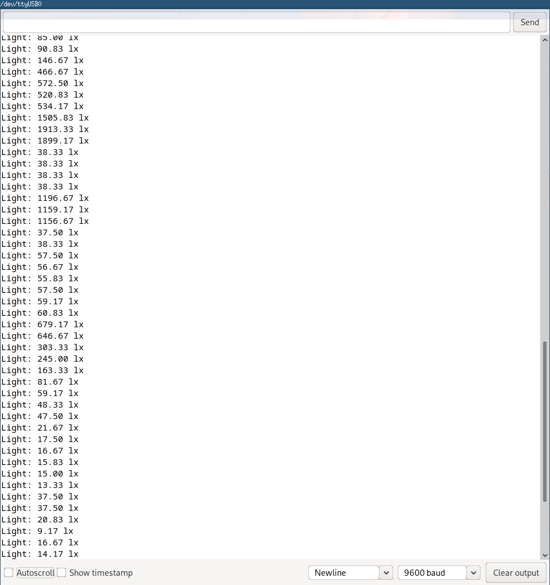

# Arduino IDE

Nesta seção, eu vou mostrar as pesquisas que foram feitas para solucionar a parte da comunicação do *ESP32*, com o sensor [*GY-30*](/sensor.md) e o site [*ThingSpeak*](https://thingspeak.com/).

## Preparando Arduino IDE

Então primerio eu instalei Arduino IDE, na versão mais recente pelo [site](https://www.arduino.cc/en/software).

Em seguida, é interessante adicionar a placa *ESP32* no Arduino IDE:
- No Arduino IDE, **File** > **Preferences**.
- Digitar o seguinte no campo “Additional Board Manager URLs”:
```
https://raw.githubusercontent.com/espressif/arduino-esp32/gh-pages/package_esp32_index.json
```
Depois clicar no botão de "OK".
- Abrir **Tools** > **Board:** > **Board Manager...**
- Procurar por **ESP32** e instalar o "ESP32 by Espressif Systems".

## Testando a Instalação

Agora eu conecto a placa *ESP32* no meu computador, e com o Arduino IDE:
- Selecionar a placa no menu **Tools** > **Board:** (no meu caso foi [**ESP32-WROOM-DA Module**](https://www.amazon.com.br/gp/product/B09491Q4F6/ref=ppx_yo_dt_b_asin_title_o08_s00?ie=UTF8&psc=1))
- Selecionar a porta **Tools** > **Port:** (no meu caso foi **/dev/ttyUSB0**)
- No caso eu escolhi usar o arquivo exemplo **File** > **Examples** > **WiFi (ESP32)** > **WiFiScan**.
- Fazer o *Upload* do arquivo:

- Abrir o Arduino IDE *Serial Monitor* e colocar a taxa de transmissão em ```115200```: 

## Instalando a **Biblioteca BH1750**

Existem várias bibliotecas para o sensor *BH1750*. Eu escolhi usar a [biblioteca BH1750 por Christopher Laws](https://github.com/claws/BH1750).
- Abrir o Arduino IDE, **Sketch** > **Include Library** > **Manage Libraries**.
- Buscar "BH1750" na caixa de pesquisa e instalar a *biblioteca BH1750 por Christopher Laws*.
- Para testar eu usei o arquivo exemplo **File** > **Examples** > **BH1750** > **BH1750test**.
- Depois de dar *Upload* com sucesso, abra o *Serial Monitor* a uma taxa de transmissão em ```9600``` e pressione o botão **RST** no *ESP32*:

