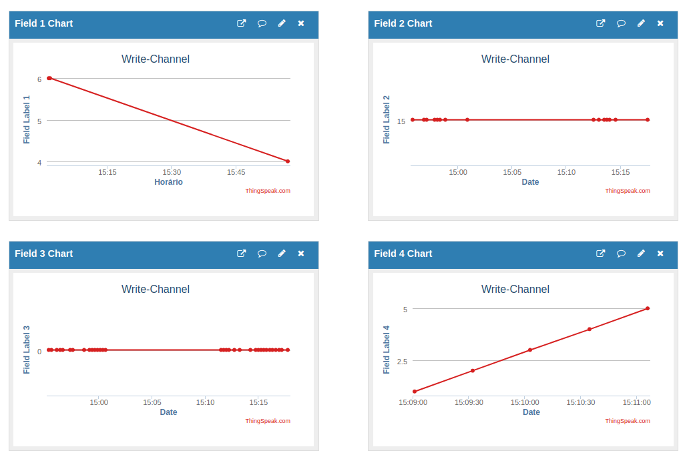
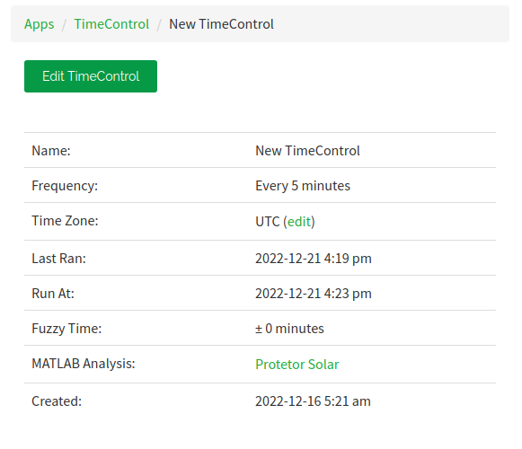

# *IoT analytics*

Para coletar os dados, será usado o **ThingSpeak**.

## Introduzindo o ThingSpeak

O [ThingSpeak](https://thingspeak.com/) é um serviço de plataforma de análise de IoT que permite agregar, visualizar e analisar fluxos de dados ao vivo na nuvem. O ThingSpeak fornece visualizações instantâneas de dados postados por seus dispositivos no ThingSpeak. Com a capacidade de executar o código MATLAB® no ThingSpeak, é possível realizar análises e processamento on-line dos dados à medida que eles chegam. O ThingSpeak é frequentemente usado para prototipagem e prova de conceito de sistemas IoT que exigem análises.

Para o projeto forma utilizados dois canais, um para a [leitura dos dados](https://thingspeak.com/channels/1901003), e outra para [enviar eles](https://thingspeak.com/channels/1975950).

### Write-Channel



Foram utilizadas quatro *Fields* para representar as variáveis:
- Field 1: Índice Ultravioleta (ESP32)
- Field 2: Fator de Proteção Solar (Aplicativo)
- Field 3: Se o usuário está praticando exercício ou em contato com àgua (Aplicativo)
- Field 4: Contagem de Tempo (ESP32)

Para saber como coletar os dados, acessar o [link](https://www.mathworks.com/help/thingspeak/collect-data-in-a-new-channel.html).

### Read-Channel

Com isso, é possível [analisar os dados](https://www.mathworks.com/help/thingspeak/analyze-your-data.html) e exportar o tempo até a próxima reaplicação para um novo canal, este que será responsável por enviar essa informação para o [aplicativo](https://t16k-ach2157.readthedocs.io/en/latest/software/aplicativo.html#aplicativo).

## API Keys

Para que isso seja possível, é necessário fazer uso das **API Keys** que permitem gravar dados em um canal ou ler dados de um canal.

### API Request

Tendo as API Keys, é possível fazer uso dos **API Request**.
- Para escrever no canal: https://api.thingspeak.com/update?api_key=<api_key>&field<numero_field>=<escrever_valor>
- Para ler o canal: https://api.thingspeak.com/channels/<numero_canal>/feeds.json?api_key=<api_key>&results=2

Note que `<api_key>`, `<numero_do_field>`, `<escrever_valor>` e `<numero_canal>` devem ser substituídos por valores reais. Se for necessário apenas ler o último update do canal, incluir o `\last` entre `feeds` e `.json`.

## MATLAB

Para analisar os dados do **Write-Channel** e escrever no **Read-Channel**, foi utilizado o **MATLAB Analysis** e o **TimeControl**.

### MATLAB Analysis

```m
readChId = 0000000;
writeChId = 0000000;  % replace with your channel number

writeKey = '0000000000000000'; % Replace with your channel write key

% Read the field
uv = thingSpeakRead(readChId,'Fields',1,'NumPoints',10);
fps = thingSpeakRead(readChId,'Fields',2);
remove = thingSpeakRead(readChId,'Fields',3);
number = thingSpeakRead(readChId,'Fields',4);

% Calculate average_uv
% average_uv = mean(uv);

% Calculate initial_value
if remove == 0
    initial_value = (66 * 30) / (average_uv * average_uv);
    if initial_value > 120; initial_value = 120; end;
else
    initial_value = (66 * 30) / (average_uv * average_uv * 2);
    if initial_value > 80; initial_value = 80; end;
end
    
% Calculate lost_percentage
% lost_percentage = (initial_value - number) / initial_value;

% remain_percentage = 100;

% Calculate remain_percentage
% remain_percentage = remain_percentage - lost_percentage;

% Calculate remain_time
remain_time = initial_value - number;
    
% Write the field
thingSpeakWrite(writeChId,[remain_time],'Fields',[1],...
    'WriteKey',writeKey);
```

No programa, foram utilizadas as fórmulas descritas nesta [seção](https://t16k-ach2157.readthedocs.io/en/latest/index.html#pesquisa), e como o ESP32 envia o valor do índice ultravioleta a cada 30 segundos, serão analisadas os primeiros 10 valores (5 minutos), para tirar uma média deles.

### TimeControl

O **TimeControl** será responsável por executar automaticamente o código acima. O tempo mínimo para ele conseguir fazer isso é de 5 minutos.


