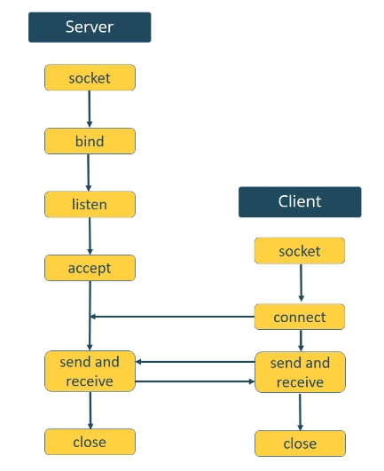

# Programas

Para este projeto, usaremos um arquivo *boot.py* e um arquivo *socket.py*. O arquivo *boot.py* tem o código que só precisa ser executado uma vez na inicialização, ele será responsável por conectar a placa ESP32 à rede de roteador e inicializar o *webrepl*.

O arquivo *socket.py* conterá o código que executa o servidor web para servir arquivos e executar tarefas com base nas solicitações recebidas pelo cliente.

## *boot.py*

```py
def do_connect(ssid, pwd):
    import network
    sta_if = network.WLAN(network.STA_IF)
    if not sta_if.isconnected():
        print('connecting to network...')
        sta_if.active(True)
        sta_if.connect(ssid, pwd)
        while not sta_if.isconnected():
            pass
    print('network config:', sta_if.ifconfig())
 
# This file is executed on every boot (including wake-boot from deepsleep)
#import esp
#esp.osdebug(None)
 
# Attempt to connect to WiFi network
do_connect('your_ssid', 'your_password')
 
import webrepl
webrepl.start()
```

O script começa criando uma função chamada ```do_connect()```. Essa função possibilitará a conexão com a internet.

Nela é importante importar a biblioteca ```network```. Essa biblioteca
nos permite conectar o *ESP32* a uma rede Wi-Fi.

Em seguida, defina o *ESP32* como uma estação Wi-Fi:
```py
sta_if = network.WLAN(network.STA_IF)
```
e ative a estação:
```py
sta_if.active(True)
```

Finalmente, o *ESP32* se conecta ao seu roteador usando o SSID e senha que serão definidos mais adiante:
```py
sta_if.connect(ssid, pwd)
```

A instrução a seguir garante que o código não proceda enquanto o *ESP32* não estiver conectado à rede.
```py
while not sta_if.isconnected():
  pass
```

Após uma conexão bem-sucedida, imprima parâmetros de interface de rede como o endereço IP ESP32 – use o método ```ifconfig()``` no objeto da estação.
```py
print('network config:', sta_if.ifconfig())
```

Agora, usamos a função para definir as variáveis referentes as credenciais de rede:
```py
do_connect('your_ssid', 'your_password')
```
É preciso substituir as palavras destacadas, com o SSID da rede e senha, para que o *ESP32* seja capaz de se conectar ao roteador.

Por fim, iniciamos o *webrepl*:
```py
import webrepl
webrepl.start()
```

## *socket.py*

```py
try:
  import usocket as socket
except:
  import socket

from machine import Pin
led = Pin(2, Pin.OUT)

def web_page():
  if led.value() == 1:
    gpio_state="ON"
  else:
    gpio_state="OFF"
  
  html = """<html><head> <title>ESP Web Server</title> <meta name="viewport" content="width=device-width, initial-scale=1">
  <link rel="icon" href="data:,"> <style>html{font-family: Helvetica; display:inline-block; margin: 0px auto; text-align: center;}
  h1{color: #0F3376; padding: 2vh;}p{font-size: 1.5rem;}.button{display: inline-block; background-color: #e7bd3b; border: none; 
  border-radius: 4px; color: white; padding: 16px 40px; text-decoration: none; font-size: 30px; margin: 2px; cursor: pointer;}
  .button2{background-color: #4286f4;}</style></head><body> <h1>ESP Web Server</h1> 
  <p>GPIO state: <strong>""" + gpio_state + """</strong></p><p><a href="/?led=on"><button class="button">ON</button></a></p>
  <p><a href="/?led=off"><button class="button button2">OFF</button></a></p></body></html>"""
  return html

s = socket.socket(socket.AF_INET, socket.SOCK_STREAM)
s.bind(('', 80))
s.listen(5)

while True:
  conn, addr = s.accept()
  print('Got a connection from %s' % str(addr))
  request = conn.recv(1024)
  request = str(request)
  print('Content = %s' % request)
  led_on = request.find('/?led=on')
  led_off = request.find('/?led=off')
  if led_on == 6:
    print('LED ON')
    led.value(1)
  if led_off == 6:
    print('LED OFF')
    led.value(0)
  response = web_page()
  conn.send('HTTP/1.1 200 OK\n')
  conn.send('Content-Type: text/html\n')
  conn.send('Connection: close\n\n')
  conn.sendall(response)
  conn.close()
```

Então agora vamos criar nosso servidor web usando *sockets* e a *API* do *socket Python*. A documentação oficial importa a biblioteca de ```socket``` da seguinte forma:
```py
try:
  import usocket as socket
except:
  import socket
```

Além disso, precisamos importar a classe ```Pin``` do módulo da ```machine``` para poder interagir com os *GPIOs*,
```py
from machine import Pin
```
e criar um objeto ```Pin``` chamado ```led``` que seja uma saída, que se refere ao *GPIO2* do *ESP32*:
```py
led = Pin(2, Pin.OUT)
```

O script cria uma função chamada ```web_page()```. Esta função retorna uma variável chamada ```html``` que contém o texto HTML para construir a página da Web.
```py
def web_page():
```

A página da *Web* exibe o estado *GPIO* atual. Então, antes de gerar o texto *HTML*, precisamos verificar o estado *LED.* Salvamos seu estado na variável ```gpio_state```:
```py
if led.value() == 1:
  gpio_state="ON"
else:
  gpio_state="OFF"
```

Depois disso, a variável ```gpio_state``` é incorporada ao texto *HTML* usando sinais "+" para concatenar *strings*.
```py
html = """<html><head> <title>ESP Web Server</title> <meta name="viewport" content="width=device-width, initial-scale=1">
<link rel="icon" href="data:,"> <style>html{font-family: Helvetica; display:inline-block; margin: 0px auto; text-align: center;}
h1{color: #0F3376; padding: 2vh;}p{font-size: 1.5rem;}.button{display: inline-block; background-color: #e7bd3b; border: none; 
border-radius: 4px; color: white; padding: 16px 40px; text-decoration: none; font-size: 30px; margin: 2px; cursor: pointer;}
.button2{background-color: #4286f4;}</style></head><body> <h1>ESP Web Server</h1> 
<p>GPIO state: <strong>""" + gpio_state + """</strong></p><p><a href="/?led=on"><button class="button">ON</button></a></p>
<p><a href="/?led=off"><button class="button button2">OFF</button></a></p></body></html>"""
```

### Criando um servidor *socket*

Depois de criar o *HTML* para construir a página da Web, precisamos criar um *socket* para receber as solicitações e enviar o texto *HTML* em resposta. Para uma melhor compreensão, a figura a seguir mostra um diagrama sobre como criar *socket* para interação servidor-cliente:



Crie um *socket* usando ```socket.socket()```, e especifique o tipo de *socket*. Criamos um novo objeto de *socket* chamado ```s``` com a família endereço dado e tipo de *socket*. Este é um *STREAM TCP socket*:
```py
s = socket.socket(socket.AF_INET, socket.SOCK_STREAM)
```

Em seguida, vincule o *socket* a um endereço (interface de rede e número de porta) usando o método ```bind()```. O método ```bind()``` aceita uma variável *tupple* com o endereço *ip* e o número da porta:
```py
s.bind(('', 80))
```
Em nosso exemplo, estamos passando uma sequência vazia ```''``` como um endereço IP e porta 80. Neste caso, a sequência vazia refere-se ao endereço IP *localhost* (isso significa o endereço IP ESP32).

A próxima linha permite que o servidor aceite conexões. O argumento especifica o número máximo de conexões enfileiadas. O máximo é 5.
```py
s.listen(5)
```

No *loop while* é onde recebemos solicitações e enviamos respostas. Quando um cliente se conecta, o servidor chama o método ```accept()``` para aceitar a conexão. Quando um cliente se conecta, ele salva um novo objeto de socket para aceitar e enviar dados sobre a variável ```conn``` e salva o endereço do cliente para se conectar ao servidor na variável ```addr```.
```py
conn, addr = s.accept()
```