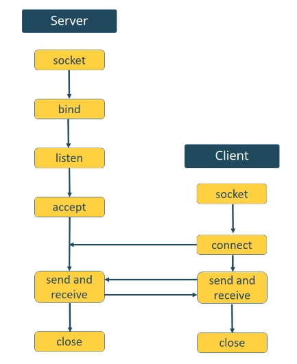

# Programas .py

Nesta seção, serão utilizados os arquivo *boot.py* e *socket.py*. 

- O arquivo *boot.py* tem o código que será executado uma vez na inicialização, ele será responsável por conectar a placa ESP32 à rede de roteador e inicializar o *webrepl*.

- O arquivo *socket.py* conterá o código que executa o servidor *web* para servir arquivos e executar tarefas com base nas solicitações recebidas pelo cliente.

## [*boot.py*](../../prog/py/boot.py)

O script começa criando uma função chamada `do_connect()`. Essa função possibilitará a conexão com a internet.

Nela é importante importar a biblioteca `network`. Essa biblioteca permite conectar o *ESP32* a uma rede Wi-Fi.

<br />

Em seguida, definir o *ESP32* como uma estação Wi-Fi:
```py
sta_if = network.WLAN(network.STA_IF)
```
e ativar a estação:
```py
sta_if.active(True)
```

<br />

Finalmente, o *ESP32* se conecta ao roteador usando o SSID e senha que serão definidos mais adiante:
```py
sta_if.connect(ssid, pwd)
```

<br />

A instrução a seguir garante que o código não proceda enquanto o *ESP32* não estiver conectado à rede.
```py
while not sta_if.isconnected():
  pass
```

<br />

Após uma conexão bem-sucedida, imprimir os parâmetros de interface de rede como o endereço IP ESP32 – usar o método `ifconfig()` no objeto da estação.
```py
print('network config:', sta_if.ifconfig())
```

<br />

Agora, usar a função para definir as variáveis referentes as credenciais de rede:
```py
do_connect('your_ssid', 'your_password')
```
É preciso substituir as palavras destacadas, com o SSID da rede e senha, para que o *ESP32* seja capaz de se conectar ao roteador.

<br />

Por fim, iniciar o *webrepl*:
```py
import webrepl
webrepl.start()
```

## [*socket.py*](../../prog/py/socket.py)

Então agora criar o servidor web usando *sockets* e a *API* do *socket Python*. A documentação oficial importa a biblioteca de `socket` da seguinte forma:
```py
try:
  import usocket as socket
except:
  import socket
```

<br />

Além disso, é preciso importar a classe `Pin` do módulo da `machine` para poder interagir com os *GPIOs*,
```py
from machine import Pin
```
e criar um objeto `Pin` chamado `led` que seja uma saída, que se refere ao *GPIO2* do *ESP32*:
```py
led = Pin(2, Pin.OUT)
```

<br />

O script cria uma função chamada `web_page()`. Esta função retorna uma variável chamada `html` que contém o texto HTML para construir a página da Web.
```py
def web_page():
```

<br />

A página da *Web* exibe o estado *GPIO* atual. Então, antes de gerar o texto *HTML*, precisamos verificar o estado *LED.* Salvamos seu estado na variável `gpio_state`:
```py
if led.value() == 1:
  gpio_state="ON"
else:
  gpio_state="OFF"
```

<br />

Depois disso, a variável `gpio_state` é incorporada ao texto *HTML* usando sinais "+" para concatenar *strings*.
```py
html = """<html><head> <title>ESP Web Server</title> <meta name="viewport" content="width=device-width, initial-scale=1">
<link rel="icon" href="data:,"> <style>html{font-family: Helvetica; display:inline-block; margin: 0px auto; text-align: center;}
h1{color: #0F3376; padding: 2vh;}p{font-size: 1.5rem;}.button{display: inline-block; background-color: #e7bd3b; border: none; 
border-radius: 4px; color: white; padding: 16px 40px; text-decoration: none; font-size: 30px; margin: 2px; cursor: pointer;}
.button2{background-color: #4286f4;}</style></head><body> <h1>ESP Web Server</h1> 
<p>GPIO state: <strong>""" + gpio_state + """</strong></p><p><a href="/?led=on"><button class="button">ON</button></a></p>
<p><a href="/?led=off"><button class="button button2">OFF</button></a></p></body></html>"""
```

### Criando um servidor *socket*

Depois de criar o *HTML* para construir a página da Web, é necessário criar um *socket* para receber as solicitações e enviar o texto *HTML* em resposta. Para uma melhor compreensão, a figura a seguir mostra um diagrama sobre como criar *socket* para interação servidor-cliente:



<br />

Criar um *socket* usando `socket.socket()`, e especificar o tipo de *socket*. Criar um novo objeto de *socket* chamado `s` com o endereço dado e tipo de *socket*. Este é um *STREAM TCP socket*:
```py
s = socket.socket(socket.AF_INET, socket.SOCK_STREAM)
```

<br />

Em seguida, vincular o *socket* a um endereço (interface de rede e número de porta) usando o método `bind()`. O método `bind()` aceita uma variável *tupple* com o endereço *ip* e o número da porta:
```py
s.bind(('', 80))
```
No exemplo, está sendo passado uma sequência vazia `''` como um endereço IP e porta 80. Neste caso, a sequência vazia refere-se ao endereço IP *localhost* (isso significa o endereço IP ESP32).

<br />

A próxima linha permite que o servidor aceite conexões. O argumento especifica o número máximo de conexões enfileiadas. O máximo é 5.
```py
s.listen(5)
```

<br />

No *loop while* é onde será recebido as solicitações e enviar as respostas. Quando um cliente se conecta, o servidor chama o método `accept()` para aceitar a conexão. Quando um cliente se conecta, ele salva um novo objeto de socket para aceitar e enviar dados sobre a variável `conn` e salva o endereço do cliente para se conectar ao servidor na variável `addr`.
```py
conn, addr = s.accept()
```
Em seguida, imprimir o endereço do cliente salvo na variável `addr`.
```py
print('Got a connection from %s' % str(addr))
```
Os dados são trocados entre o cliente e o servidor usando os métodos `send()` e `recv()`.

<br />

A linha a seguir recebe a solicitação recebida no *socket* recém-criado e salva-a na variável `request`.
```py
request = conn.recv(1024)
```
O método `recv()` recebe os dados do *client socket* (lembre-se que foi criado um novo objeto de socket na variável `conn`). O argumento do método `recv()` especifica os dados máximos que podem ser recebidos de uma só vez.

<br />

A próxima linha simplesmente imprime o conteúdo da solicitação:
```py
print('Content = %s' % str(request))
```

<br />

Em seguida, criar uma variável chamada `response` contendo o texto *HTML* devolvido pela função `web_page()`:
```py
reponse = web_page()
```

<br />

Por fim, enviar a resposta ao *socket client* usando os métodos de `send()` e `sendall()`:
```py
conn.send('HTTP/1.1 200 OK\n')
conn.send('Content-Type: text/html\n')
conn.send('Connection: close\n\n')
conn.sendall(response)
```

<br />

Por fim, fechar o *socket* criado.
```py
conn.close()
```
